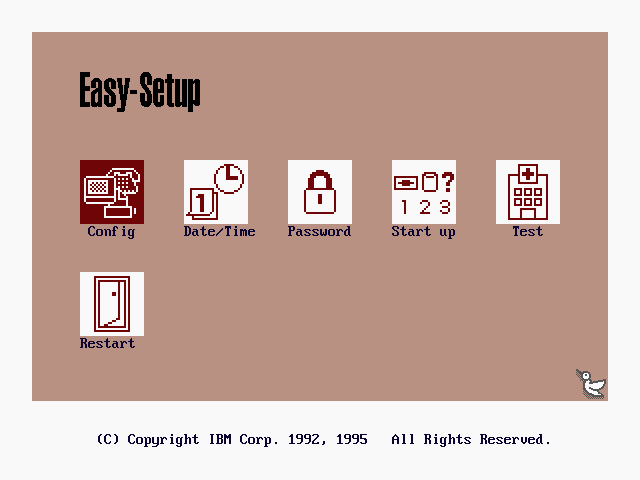
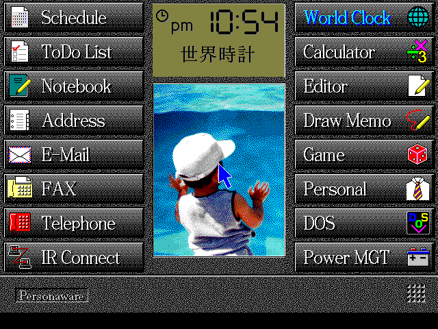
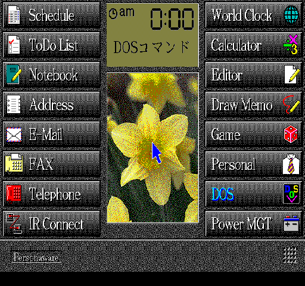

# IBM Palm Top PC 110 Core for MiSTer

A MiSTer core for the IBM Palm Top PC 110, the pocketable 486 PC that IBM sold
in Japan in 1995. It combines MiSTer's established x86 CPU and PC-compatible
devices with a PC110-specific chipset, memory map, flash layout and storage
profile.

And it boots. The core gets through the real IBM BIOS POST with no errors, runs
IBM Easy-Setup, and takes PC DOS J7.0/V all the way into the PersonaWare
desktop with the keyboard and Japanese text working. Still a work in progress
though, not every chip on the planar is modelled cycle-for-cycle. See
[docs/STATUS.md](docs/STATUS.md) for what's verified and what's left.

## What works

* 486SX (no FPU) at a fixed 30 MHz, which is the closest match to the real
  machine I've been able to pin down so far
* selectable PC110 RAM module: none, 4 MB, 8 MB or 16 MB, giving 4 MB,
  8 MB, 12 MB or 20 MB total; 16 MB remains the default
* the full 256 KB PC110 flash mapped at C0000-FFFFF
* VL82C420/SCAMP config ports and their unlock sequences
* PCMCIA register file, font-ROM banking with the 1 MB Japanese font image,
  the inking port and both EC windows
* IDE, floppy, VGA, keyboard and mouse through the shared PC-compatible blocks
* PC110-specific IBM Easy-Setup LCD colors, matched to the real-hardware
  reference palette documented by PC110-EMU
* COM1/internal-modem transport through MiSTer Main, with a PC110-specific
  19,200-baud profile
* PC110 CMOS layout

Most of this came from prodding real hardware (the Open-Source-PC110 captures)
and disassembling the BIOS, cross-checked against the PC110-EMU emulator. I use
PC110-EMU as a reference, not something to copy from: its interpreter takes
shortcuts that aren't how the hardware actually behaves, so anything that
mattered got checked on the metal.

## Screenshots

IBM Easy-Setup, running straight off the flash image with working keyboard
navigation and the hardware-matched mauve, maroon and dark-blue LCD palette:



PersonaWare V1.0 after an unattended boot:



The same PersonaWare desktop running on the DE25-Nano through the Agilex
framebuffer scaler:



## ROMs

No IBM firmware ships with this repo, you supply your own dump.

You need the PC110 BIOS flash (IBM 39H4551, 262144 bytes):

    SHA-256  232101c88466f311bcc32fbc215a4d7569f695ce19f9c07ca67ce2aee5232312

and optionally the 1 MB Japanese font ROM. Run them through:

    scripts/prepare-roms.sh /path/to/pc110_bios.bin /path/to/MSM538032E@SOP44.BIN

That validates the input, makes a working copy with two small Easy-Setup
patches, and writes out `boot0.rom`, `boot1.rom`, the full `pc110_bios.bin`, and
`pc110_font.bin`. Your original dump is never modified.

The two patches only touch the copy: one routes the setup key straight to the
IBM loader, the other swaps an unavailable SMM call for the equivalent direct
port write.

## Building

Quartus 17.0.2 in the raetro container, same as the rest of the cores:

    scripts/test.sh
    scripts/build.sh

To build on a separate Quartus host over SSH:

    BUILD_HOST=user@quartus-builder scripts/build-remote.sh

The bitstream ends up in `artifacts/PC110.rbf`. Set `DOCKER_BIN`,
`DOCKER_CONTEXT` or `QUARTUS_IMAGE` if your setup needs it. There's a
hardware-tested build under [releases/](releases) if you'd rather not compile.

### DE25-Nano Agilex 5 port

The complete MiSTer platform port is under [`mister-de25/`](mister-de25), with
the original PC110-specific board bring-up retained under
[`de25-nano/`](de25-nano). The port includes the Agilex HPS shell, ARM64 Main
patches, Menu port, PC110 integration, onboard SDRAM and LPDDR4 adapters,
runtime core switching, guarded FPGA loading, screenshot support, build
scripts, and regression tests. It targets Quartus Prime Pro 25.3.1.

The DE25-Nano already has 128 MB of 16-bit FPGA SDRAM onboard, so this port
does not require an external MiSTer SDRAM module.

Run the source-level test suites with:

    scripts/test.sh
    mister-de25/scripts/test.sh

Build the Menu and PC110 images with:

    mister-de25/scripts/build-menu.sh
    mister-de25/scripts/build-pc110.sh

The hardware-confirmed PC110 image is
[`DE25_IBM_PC110_20260823_VERTICAL_ACCUM_FIX.rbf`](releases/DE25_IBM_PC110_20260823_VERTICAL_ACCUM_FIX.rbf).
Its `.sha256` and `.hps-io-hash` sidecars are required by the guarded DE25
runtime loader. The build fixes the 1024-profile scaler's vertical accumulator
so the complete 480-line frame is read and displayed. IBM firmware and disk
images are not included.

## Installing

Copy the RBF into `_Computer` and drop `pc110_bios.bin` (and `pc110_font.bin`
if you have it) into `games/ao486`. If you can SSH into your MiSTer this does
the lot:

    MISTER_HOST=root@mister.local scripts/deploy-mister.sh

The deploy script installs the RBF as `IBM PC110_<date>.rbf`, so the MiSTer core
browser shows **IBM PC110**. Internally the core advertises the standard
`AO486` x86 service identity. This lets stock Main provide IDE, CMOS and
boot-ROM services without a PC110-specific machine profile. Consequently
`/tmp/CORENAME`, the Home folder, saved OSD state and remembered file paths use
the AO486 name. Back up an existing ao486 setup before installing PC110 ROMs or
configuration on the same SD card.

### Hard-disk geometry

PC110-compatible VHDs must declare the machine's native CHS geometry in a
same-basename `.cfg` file beside the image. For `Personaware-disk.vhd`, create
`Personaware-disk.cfg` containing:

```ini
HEADS = 2
SECTORS = 32
CYLINDERS = 128
```

`CYLINDERS` must equal `image_size / (512 * HEADS * SECTORS)` when the entire
image is addressable. Keep the spaces around `=`; Main's legacy metadata parser
requires them. The example above is for a 4 MiB raw VHD. Main reads this
standard image metadata before the core-supplied fallback geometry, so no
PC110-specific geometry code is required in Main. A copyable template is in
[`examples/pc110-vhd.cfg`](examples/pc110-vhd.cfg).

### Main integration

Stock Main provides the required x86 transport. The optional patch series in
`scripts/main-patches` contains only generic ATA diagnostic/read-verify command
handling. It neither identifies PC110 nor overrides image geometry. The work is
under review as
[Main_MiSTer#1252](https://github.com/MiSTer-devel/Main_MiSTer/pull/1252).

    scripts/apply-main-patches.sh /path/to/Main_MiSTer

then build Main the usual way in the arm toolchain container.

## Notes

* WIN+F12 opens the PC110 OSD. Plain F12 passes through as a normal PC key.
* Mount a raw VHD plus its same-basename geometry `.cfg` at IDE 0-0, and hit
  "Reset and apply HDD" after you change disks.
* Changing the RAM Module setting automatically resets the machine. The OSD
  shows both the module capacity and resulting total memory.
* Loading the whole flash isn't redundant. Main's usual `boot1.rom` path only
  loads part of the image, but early PC110 POST wants all 256 KB up at
  C0000-FFFFF, so FC7 writes the full image to DDR and the split ROMs overlay
  the same bytes.
* The PersonaWare disk's stock EMM386 line asks for an EMS page frame that sits
  on top of the PC110 upper-memory map and stops for a keypress on every boot.
  `scripts/patch-personaware-noems.sh` flips it to XMS/UMB only (it keeps a
  `.pre-noems` backup).

## Credits and license

The CPU and platform RTL come from the ao486 core (originally Aleksander Osman,
reworked for MiSTer by Sorgelig); those files keep their upstream licenses and
attribution. Everything PC110-specific is GPL-3.0-or-later. See
[LICENSE](LICENSE), [THIRD_PARTY_NOTICES.md](THIRD_PARTY_NOTICES.md) and the
per-file headers. No IBM firmware is included.
